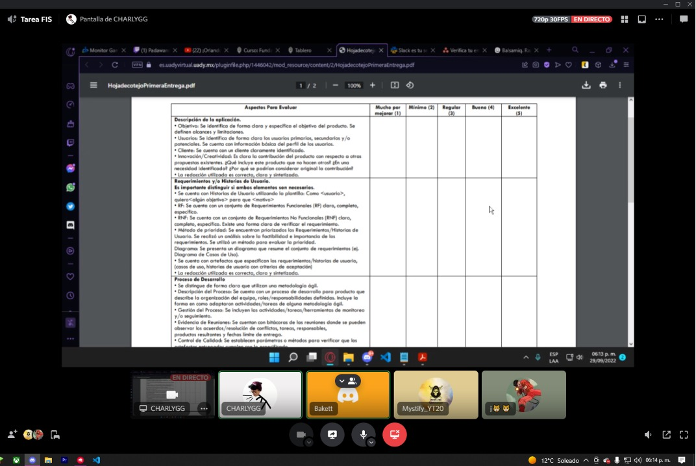

<h1>Entrevista</h1>  

Nuestro cliente se acercó a nosotros el día 17 de septiembre, con la petición de una página web que ayudará a modernizar, agilizar y promover su negocio, dando una mayor facilidad a sus clientes a la hora de utilizar el servicio. Esto marcó el inicio de nuestro proyecto.
 

El dueño de una compañía de autobuses, que cuenta con una terminal en Tizimín, quiere una página web donde se pueda facilitar la compra de boletos, revisión de horarios y destinos, y el acceso a información sobre esta compañía. 
 

Al aceptar su propuesta, nos reunimos con él tres días después, 20 de septiembre, para discutir más a fondo lo que requiere para su página y cómo trabajaríamos en ella. Se establecieron algunas bases de las funcionalidades que ésta tendría, como:
 

●	Poder comprar los boletos con pago en línea
●	Acceder a horarios y destinos en tiempo real, con actualizaciones
●	El diseño de la página sería en relación a el diseño ya establecido del logo y los camiones de la compañía
●	Fácil de navegar y con una interfaz sencilla

 

Por nuestra parte nos reunimos por separado el 29 de septiembre, para discutir estos puntos y realizar una división formal del trabajo.
 

Aquí comenzó la organización oficial de nuestro proyecto, y la decisión de estrategias que utilizaremos para cumplir con los requisitos de nuestro cliente en la realización de esta página web.
 